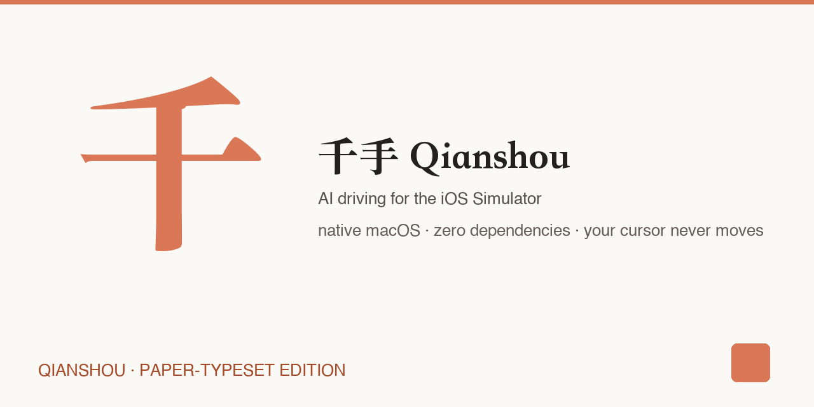
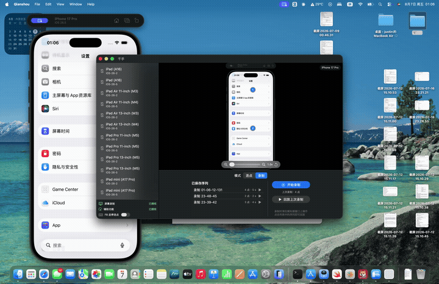

<p align="center" style="font-family: Georgia, 'Times New Roman', serif; background: #FAF9F5; padding: 40px 20px 20px;">
  <span style="font-size: 52px; font-weight: bold; color: #23211E; letter-spacing: 2px;">千手 · Qianshou</span><br/>
  <span style="font-size: 18px; color: #57534C;">AI driving for the iOS Simulator — describe a goal, watch it operate</span><br/>
  <span style="font-size: 14px; color: #A64B2A;">native macOS · zero dependencies · your cursor never moves</span>
</p>

<p align="center">
  
</p>

<p align="center">
  
</p>

<p align="center">
  
  
  
  
  
  
</p>

---

## <span style="font-family: Georgia, serif; color: #A64B2A;">What is it</span>

<span style="font-family: Georgia, serif; font-size: 17px; color: #23211E;">A paper-typeset cockpit for the iOS Simulator.</span> Qianshou turns your simulator into a workspace you can drive by description, by click, or by script — without ever touching your mouse.

<table style="border-collapse: collapse; width: 100%; background: #F2EFE8; border-radius: 8px;">
<tr>
<td style="padding: 16px; width: 33%; border-right: 1px solid #D8D2C6;">
  <p style="margin: 0 0 6px; font-family: Georgia, serif; font-weight: bold; color: #A64B2A; font-size: 15px;">✨ AI driving</p>
  <p style="margin: 0; font-size: 13px; color: #57534C;">"open Settings and enable dark mode" — the agent sees the screen, decides, operates. Pause for your input, or insert manual instructions mid-run.</p>
</td>
<td style="padding: 16px; width: 33%; border-right: 1px solid #D8D2C6;">
  <p style="margin: 0 0 6px; font-family: Georgia, serif; font-weight: bold; color: #A64B2A; font-size: 15px;">🖱️ No mouse, ever</p>
  <p style="margin: 0; font-size: 13px; color: #57534C;">Touch injection goes through XCTest inside the simulator (WebDriverAgent). Replay, auto-click, AI — your cursor stays put.</p>
</td>
<td style="padding: 16px; width: 33%;">
  <p style="margin: 0 0 6px; font-family: Georgia, serif; font-weight: bold; color: #A64B2A; font-size: 15px;">🎬 Record & replay</p>
  <p style="margin: 0; font-size: 13px; color: #57534C;">Clicks and drags with precise timing, persisted as JSON. Replay exactly as recorded — sequences survive restarts.</p>
</td>
</tr>
</table>

<table style="border-collapse: collapse; width: 100%; margin-top: 8px; background: #F2EFE8; border-radius: 8px;">
<tr>
<td style="padding: 16px; width: 33%; border-right: 1px solid #D8D2C6;">
  <p style="margin: 0 0 6px; font-family: Georgia, serif; font-weight: bold; color: #A64B2A; font-size: 15px;">🖥️ Live mirror</p>
  <p style="margin: 0; font-size: 13px; color: #57534C;">ScreenCaptureKit at 60fps, zoom 1–4×, pan, crosshair with live coordinates, draggable points.</p>
</td>
<td style="padding: 16px; width: 33%; border-right: 1px solid #D8D2C6;">
  <p style="margin: 0 0 6px; font-family: Georgia, serif; font-weight: bold; color: #A64B2A; font-size: 15px;">📦 App install</p>
  <p style="margin: 0; font-size: 13px; color: #57534C;">Drop in a `.app` or `.ipa`, auto-launched. Simulator management from the toolbar.</p>
</td>
<td style="padding: 16px; width: 33%;">
  <p style="margin: 0 0 6px; font-family: Georgia, serif; font-weight: bold; color: #A64B2A; font-size: 15px;">⌨️ Keyboard-first</p>
  <p style="margin: 0; font-size: 13px; color: #57534C;">⌘1/2/3 switch activities · ⌘K command palette · Space starts/stops · F8 works globally.</p>
</td>
</tr>
</table>

---

## <span style="font-family: Georgia, serif; color: #A64B2A;">The design</span>

<span style="font-size: 14px; color: #57534C;">The paper-typesetting tradition (the Claude aesthetic): warm paper, one terracotta accent, three type roles.</span>

<table style="border-collapse: collapse; width: 100%;">
<tr>
<td style="padding: 10px; background: #FAF9F5; border: 1px solid #D8D2C6; border-radius: 6px; text-align: center;">
  <div style="width: 44px; height: 44px; border-radius: 6px; background: #FAF9F5; border: 1px solid #D8D2C6; display: inline-block;"></div>
  <div style="font-family: monospace; font-size: 11px; color: #57534C;">paper #FAF9F5</div>
</td>
<td style="padding: 10px; background: #F2EFE8; border: 1px solid #D8D2C6; border-radius: 6px; text-align: center;">
  <div style="width: 44px; height: 44px; border-radius: 6px; background: #F2EFE8; border: 1px solid #D8D2C6; display: inline-block;"></div>
  <div style="font-family: monospace; font-size: 11px; color: #57534C;">panel #F2EFE8</div>
</td>
<td style="padding: 10px; background: #D97757; border: 1px solid #D8D2C6; border-radius: 6px; text-align: center;">
  <div style="width: 44px; height: 44px; border-radius: 6px; background: #D97757; border: 1px solid #C96A4C; display: inline-block;"></div>
  <div style="font-family: monospace; font-size: 11px; color: #23211E;">accent #D97757</div>
</td>
<td style="padding: 10px; background: #23211E; border: 1px solid #D8D2C6; border-radius: 6px; text-align: center;">
  <div style="width: 44px; height: 44px; border-radius: 6px; background: #23211E; border: 1px solid #3A3734; display: inline-block;"></div>
  <div style="font-family: monospace; font-size: 11px; color: #E8E6E1;">ink #23211E</div>
</td>
</tr>
</table>

<span style="font-size: 13px; color: #57534C;">Three type roles — <b>serif</b> for titles, <b>sans</b> for function, <b>mono</b> for data. Every contrast pair computed and documented (14.7:1 body, 5.3:1 accent text). Tokens live in <code>Qianshou/Support/DesignTokens.swift</code>.</span>

---

## <span style="font-family: Georgia, serif; color: #A64B2A;">Quick start</span>

Requires macOS 14+, Xcode 15+, and an iOS Simulator.

```bash
brew install xcodegen
xcodegen generate
xcodebuild -project Qianshou.xcodeproj -scheme Qianshou -configuration Debug build
```

Or grab the latest release from **[Releases](https://github.com/tianhaishun/qianshou/releases)**.

**One-command setup** (detect → build → touch service → launch):

```bash
./Scripts/setup.sh
```

### CLI — scripted replay

```bash
./Scripts/setup.sh                      # once
build/Debug/qianshou list               # list saved sequences
build/Debug/qianshou run examples/demo-settings-browse.json
build/Debug/qianshou run examples/demo-smoke-flow.json --loops 3
```

The CLI shares the same touch-injection pipeline as the app — replay sequences headlessly for CI or scripting. Example sequences ship in `examples/`.

### First-run setup

1. **Start the touch-injection service** (once per simulator boot — no code signing needed):
   ```bash
   ./Scripts/start_wda.sh
   ```
2. **Screen Recording permission** (system prompt) for the live mirror.

No Accessibility permission needed: touch injection goes through XCTest inside the simulator, not macOS mouse events.

### AI driving

Add your Anthropic API key in the PILOT panel settings (Opus 4.8 / Sonnet 5 / Fable 5). Keys stay in your local UserDefaults.

---

## <span style="font-family: Georgia, serif; color: #A64B2A;">How it works</span>

```
macOS                              iOS Simulator
┌──────────────────────────┐       ┌──────────────────────┐
│  Qianshou (SwiftUI)      │       │  WebDriverAgent       │
│  · Mirror (SCK 60fps)    │  HTTP │  (XCTest runner)      │
│  · AI agent (Claude API) │──────▶│      ↓ testmanagerd   │
│  · Record/Replay         │ :8100 │  iOS touch synthesis  │
│  · Click engine          │       └──────────────────────┘
└──────────────────────────┘       └──────────────────────┘
```

- **Coordinates are content-relative (0–1)** — window moves and resizes never break accuracy
- Recording listens to *your* real input; injection happens *inside the simulator* — the two never mix
- Simulator-side XCTest needs **no code signing** (unlike the real-device story)

---

## <span style="font-family: Georgia, serif; color: #A64B2A;">Development</span>

```bash
xcodegen generate        # required after adding/removing files
xcodebuild -project Qianshou.xcodeproj -scheme Qianshou -destination 'platform=macOS' test -only-testing:QianshouTests
```

**22 unit tests** cover coordinate math, sequence JSON, and the HTTP layer (URLProtocol stubs). UI tests run locally — macOS headless CI can't drive SwiftUI reliably.

Debug log: `/tmp/qianshou_debug.log`

## <span style="font-family: Georgia, serif; color: #A64B2A;">Roadmap</span>

- [x] AI driving (Claude vision + element tree, manual override)
- [x] Record & replay (clicks + drags, JSON persistence)
- [x] Touch injection without mouse (XCTest)
- [x] App install & launch
- [x] Command palette (⌘K)
- [x] CLI mode (`qianshou run script.json`, `--loops`)
- [ ] Element-level automation (assertions, loops)
- [ ] Sequence loops & waits in the editor

## <span style="font-family: Georgia, serif; color: #A64B2A;">FAQ</span>

**Does this work with a physical iPhone?** Not yet — simulator-focused. A real-device path (WebDriverAgent signing) was prototyped and shelved.

**Why not Appium / WebDriverAgent / idb?** Those are powerful but heavyweight. Qianshou is the opposite end: native app, one script, describe-and-go.

**Why "paper" design?** The simulator cockpit is a *workspace*, not a game — warm paper, quiet borders, and data you can read at a glance.

---

<p align="center" style="font-family: Georgia, serif;">
  <span style="color: #A64B2A; font-size: 15px;">MIT License</span> ·
  <span style="color: #57534C; font-size: 13px;">PRs welcome — keep the zero-dependency rule</span>
</p>
